# Prosperity - Data Flow & State Management Diagrams

**Version:** 1.1  
**Date:** October 15, 2025  
**Purpose:** Visual representation of data flow patterns and state management

---

## Important: Data Management Philosophy

**Flexible & Editable Approach:**

This system follows a flexible, user-controlled data management approach:

1. **Optional Transaction Fields**: All transaction amounts, fees, and costs are optional inputs. The system calculates with whatever data is provided.

2. **Fully Editable Values**: All holding values (quantity, purchase price, fees, total invested) and account cash balances remain fully editable at any time after creation.

3. **No Audit Trail**: Only current final values are stored. No historical changes or audit logs are maintained.

4. **Manual Adjustments Welcome**: Users can adjust any value at any time for:
   - Dividends received
   - Interest earned
   - Fees discovered later
   - Manual corrections
   - Any other reason

5. **Optional Automatic Updates**: Cash balance updates from transactions (deposits, withdrawals, transfers, purchases, sales) are optional and configurable based on user preference.

6. **No Enforcement**: No validation prevents negative balances or insufficient funds. All values are user-manageable.

---

## UI Loading Strategy - Hierarchical Panel System

**Progressive Disclosure with Smart Background Refresh:**

The interface uses a hierarchical panel system with stored calculated values and intelligent data freshness management:

1. **Panel Hierarchy**:
   - **Portfolio Panel** (top level) - Shows total portfolio summary
   - **Account Panels** (sub-level) - Shows account summaries when portfolio expanded
   - **Stock Panels** (detail level) - Shows individual stock details when account expanded

2. **Data Storage Strategy**:
   - **Stock Level**: All values stored with price, calculations, and `lastUpdated` timestamp
   - **Account Level**: Pre-calculated totals from constituent stocks with `lastUpdated` timestamp
   - **Portfolio Level**: Pre-calculated totals from all accounts with `lastUpdated` timestamp

3. **Initial Load Behavior**:
   - Single bulk database lookup retrieves all stored data
   - Interface populates immediately with stored values
   - Fast initial render (< 2 seconds) using pre-calculated data

4. **Data Freshness System**:
   - **Fresh Data** (< 15 minutes): Display normally with clean interface
   - **Stale Data** (> 15 minutes): Display with dark overlay + faint spinner
   - User sees data immediately but knows it's being refreshed

5. **Background Refresh Process**:
   - Triggered automatically when stale data detected
   - Also triggered on panel expansions if data is stale
   - Bulk API call fetches all live prices and exchange rates
   - All calculations updated in backend
   - Database bulk update with new values and timestamps
   - Interface receives fresh data and removes overlays/spinners

6. **User Experience Benefits**:
   - **Immediate Response**: Interface always loads instantly
   - **Data Availability**: Never blocked by API calls or network issues
   - **Visual Feedback**: Clear indication when data is being refreshed
   - **Progressive Enhancement**: Fresh data replaces stale data seamlessly
   - **Reduced API Costs**: Bulk operations instead of individual calls

### Panel Interaction & Background Refresh Flow

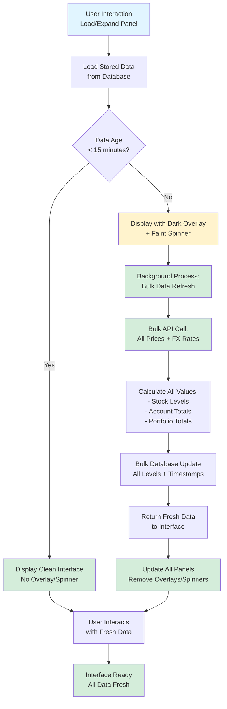

### Hierarchical Panel Structure

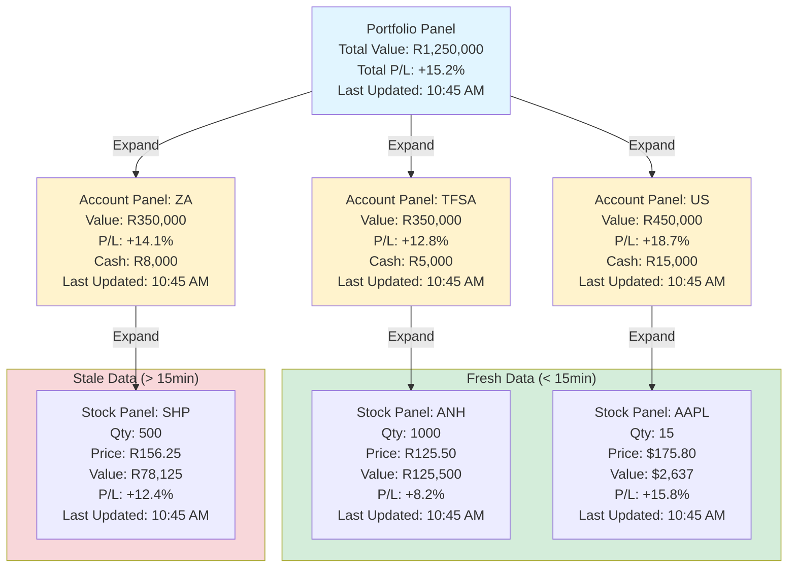

---

## Table of Contents
1. [UI Loading Strategy - Hierarchical Panel System](#ui-loading-strategy---hierarchical-panel-system)
2. [Hierarchical Panel Structure](#hierarchical-panel-structure)
3. [Data Flow Overview](#data-flow-overview)
4. [State Management (Fluxor)](#state-management-fluxor)
5. [Portfolio Calculation Flow](#portfolio-calculation-flow)
6. [Cash Balance Management Flow](#cash-balance-management-flow)
7. [Multi-Currency Conversion Flow](#multi-currency-conversion-flow)

---

## Data Flow Overview

This diagram shows how data flows through the entire system from user action to database persistence.

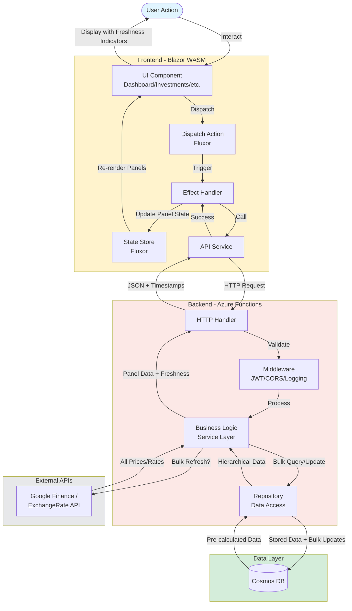

---

## State Management (Fluxor)

This diagram shows the Redux-pattern state management using Fluxor in the Blazor frontend.

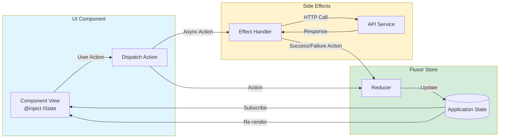

### Example State Structure

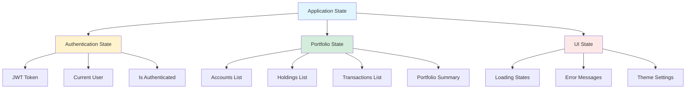

---

## Portfolio Calculation & Storage Flow

This diagram shows how portfolio metrics are calculated, stored, and retrieved with timestamp tracking.

```mermaid
flowchart TD
    Trigger[Background Refresh Triggered<br/>Data > 15 minutes old]
    
    Trigger --> Fetch[Bulk API Fetch<br/>All Current Prices + FX Rates]
    
    Fetch --> Holdings[Calculate Stock Level]
    Holdings --> H1{For Each Holding}
    H1 --> H2[Current Price × Quantity<br/>= Current Value]
    H2 --> H3[Current Value - Total Invested<br/>= Profit/Loss Amount]
    H3 --> H4["(P/L Amount / Total Invested) × 100<br/>= P/L Percentage"]
    H4 --> H5[Currency Conversion<br/>with fresh FX rates]
    
    H5 --> Store1[Store Stock Data:<br/>- All calculated values<br/>- Current price<br/>- lastUpdated timestamp]
    
    Store1 --> AccLevel[Calculate Account Level]
    AccLevel --> A1{For Each Account}
    A1 --> A2[Sum Holdings Current Values<br/>= Account Current Value]
    A2 --> A3[Sum Holdings Total Invested<br/>= Account Invested]
    A3 --> A4[Account Current Value - Account Invested<br/>= Account P/L]
    A4 --> A5[Account Cash Balance<br/>+ Account Current Value<br/>= Account Total Balance]
    
    A5 --> Store2[Store Account Data:<br/>- All calculated totals<br/>- lastUpdated timestamp]
    
    Store2 --> PortLevel[Calculate Portfolio Level]
    PortLevel --> P1[Sum All Account Values<br/>= Total Current Value]
    P1 --> P2[Sum All Account Invested<br/>= Total Invested]
    P2 --> P3[Sum All Account Cash<br/>= Total Cash]
    P3 --> P4[Total Current Value - Total Invested<br/>= Total P/L]
    
    P4 --> Store3[Store Portfolio Data:<br/>- All calculated totals<br/>- lastUpdated timestamp]
    
    Store3 --> BulkDB[Bulk Database Update<br/>All Levels + Timestamps]
    
    BulkDB --> Return[Return Fresh Data<br/>to Interface]
    
    Return --> Update[Update All Panels<br/>Remove Stale Indicators]

    style Trigger fill:#e1f5ff
    style Fetch fill:#d4edda
    style Store1 fill:#fff3cd
    style Store2 fill:#fff3cd
    style Store3 fill:#fff3cd
    style BulkDB fill:#d4edda
    style Update fill:#d4edda
```

---

## Cash Balance Management Flow

This diagram shows how cash balances can be updated by various operations. **Important:** All balance updates are optional and configurable. The cash balance field remains fully editable at all times for manual adjustments.

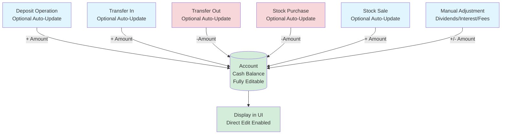

**Note:** The error checking for balance validation has been removed. Users can adjust balances freely, and all transaction updates to cash balance are optional based on user settings.

### Cash Balance Formula

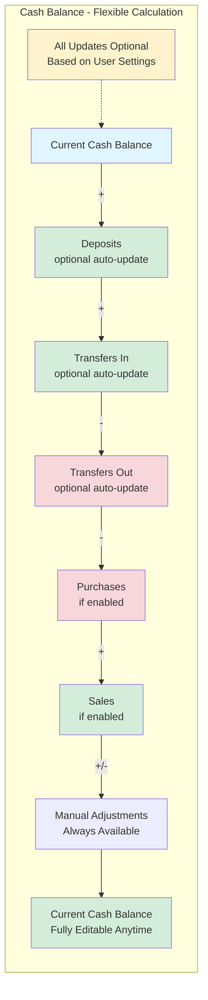

**Key Points:**
- Cash balance starts at user-defined value (default $0)
- All transaction-based updates are optional (user configurable)
- Manual adjustments always available for dividends, interest, fees, or corrections
- No audit trail maintained - only current value stored
- Balance can be edited directly at any time without restrictions

---

## Multi-Currency Conversion Flow

This diagram shows how multi-currency holdings are converted to the base currency (ZAR).

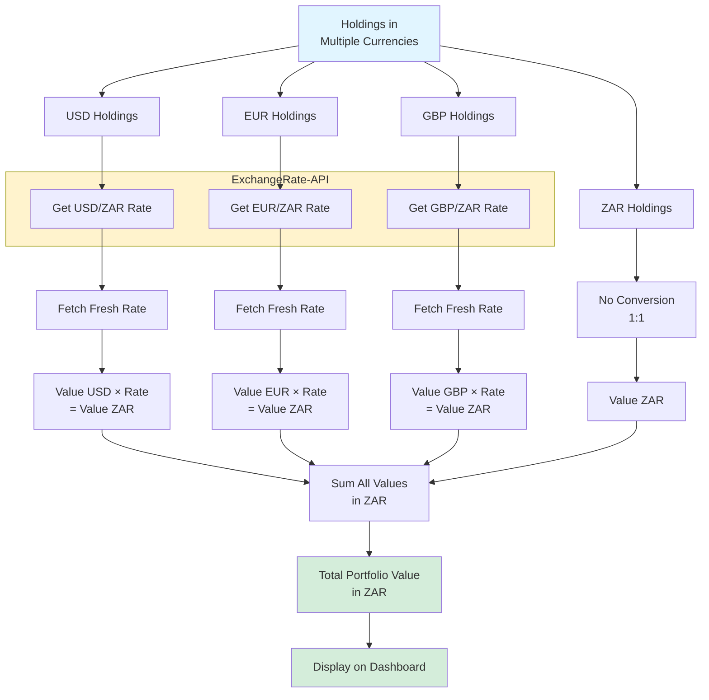

### Currency Conversion Example

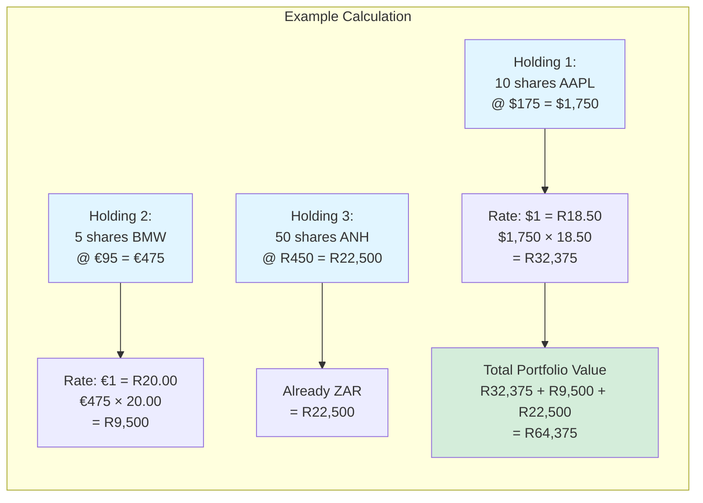

---

## Average Cost Basis Calculation

This diagram shows how average cost basis is calculated for multiple purchases of the same stock.

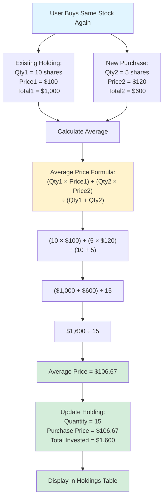

---

## API Request/Response Cycle

This diagram shows the complete lifecycle of an API request.

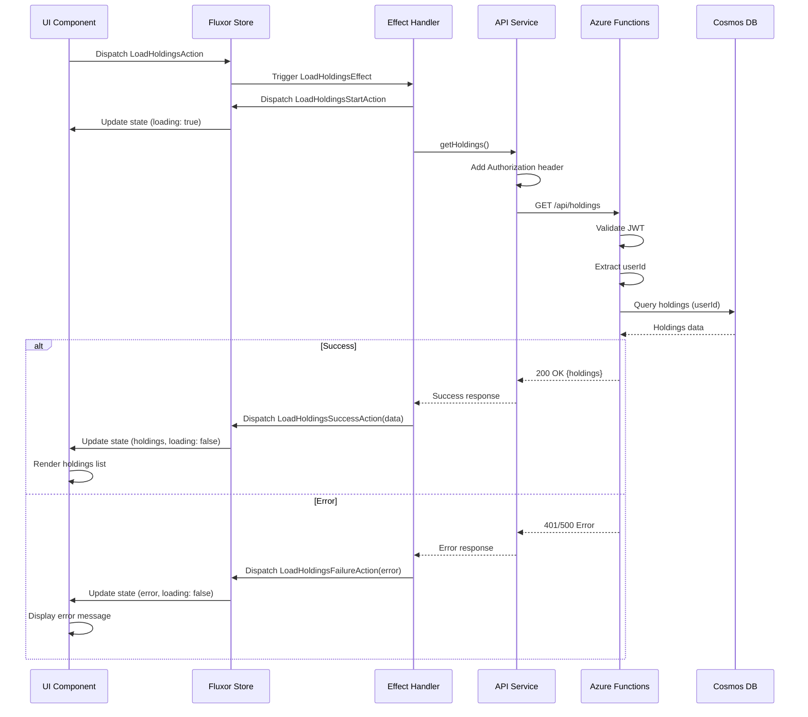

---

*Last Updated: October 15, 2025*
