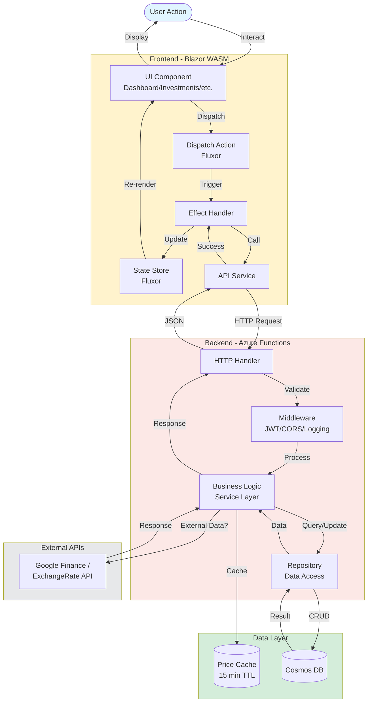
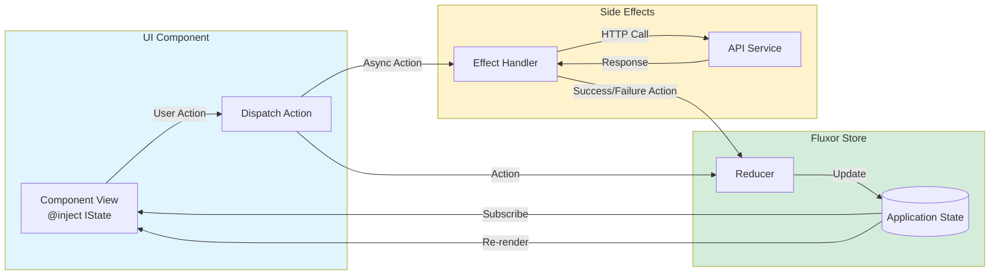
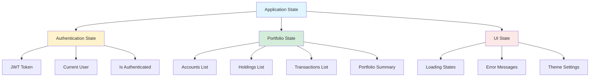
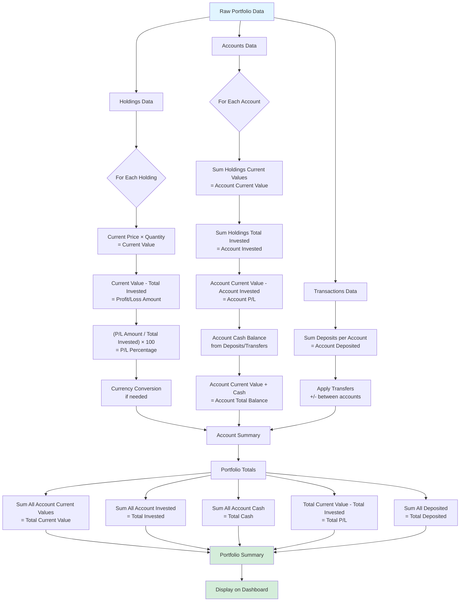
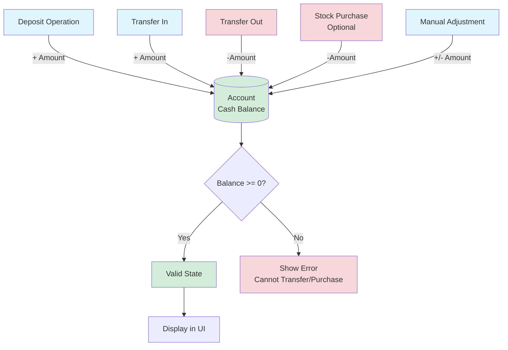
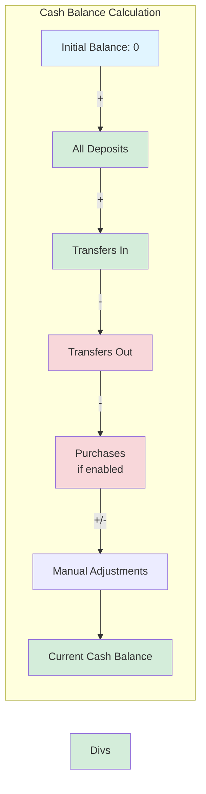
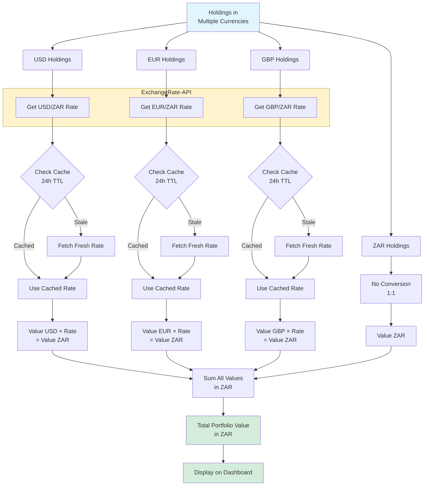
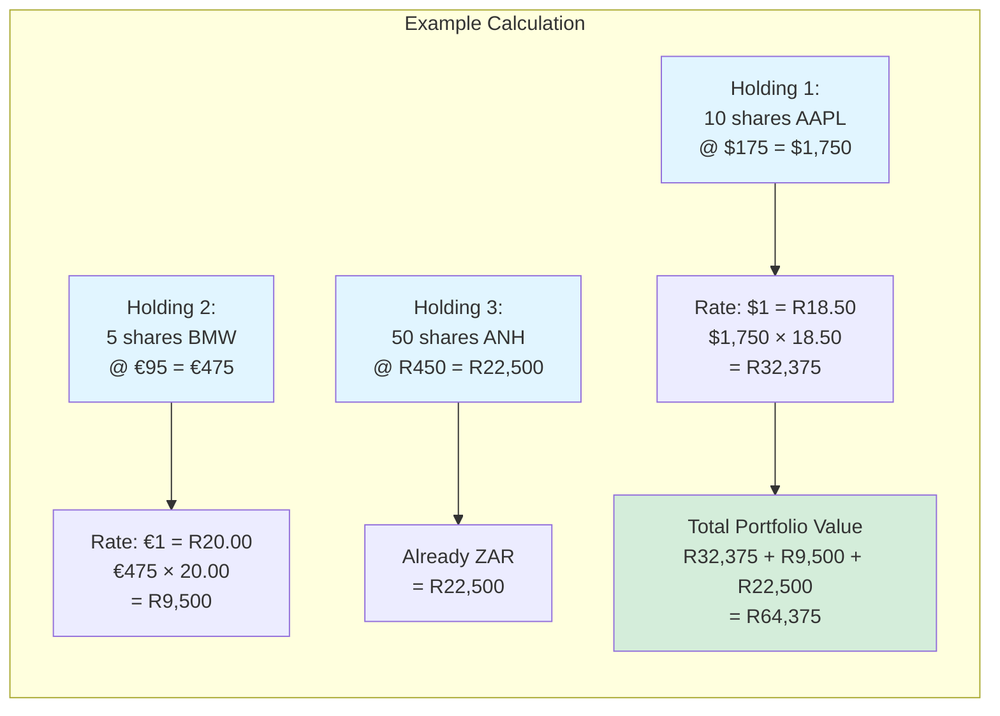
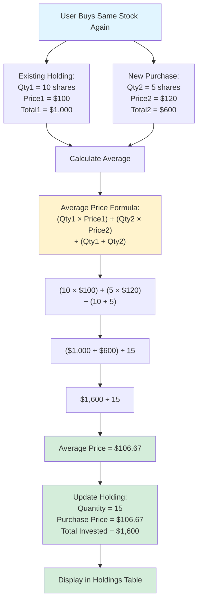
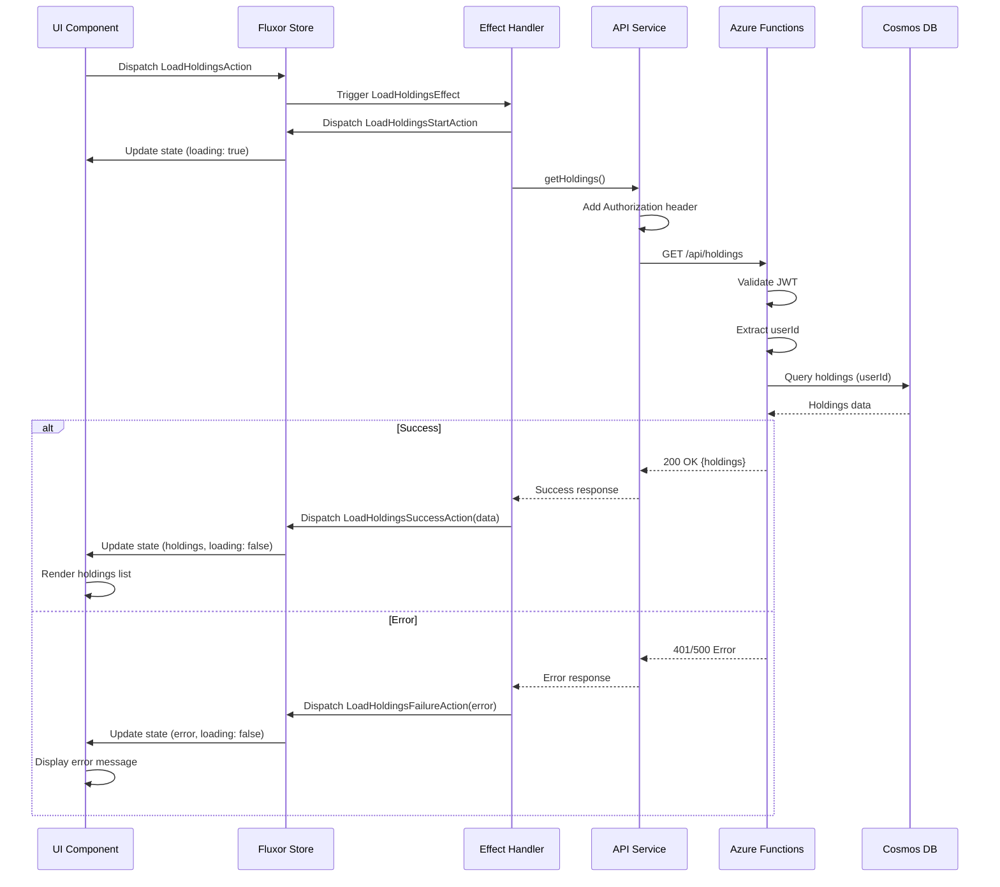

# Prosperity - Data Flow & State Management Diagrams

**Version:** 1.0  
**Date:** October 15, 2025  
**Purpose:** Visual representation of data flow patterns and state management

---

## Table of Contents
1. [Data Flow Overview](#data-flow-overview)
2. [State Management (Fluxor)](#state-management-fluxor)
3. [Portfolio Calculation Flow](#portfolio-calculation-flow)
4. [Cash Balance Management Flow](#cash-balance-management-flow)
5. [Multi-Currency Conversion Flow](#multi-currency-conversion-flow)

---

## Data Flow Overview

This diagram shows how data flows through the entire system from user action to database persistence.

---

## State Management (Fluxor)

This diagram shows the Redux-pattern state management using Fluxor in the Blazor frontend.

### Example State Structure

---

## Portfolio Calculation Flow

This diagram shows how portfolio metrics are calculated from raw data.

---

## Cash Balance Management Flow

This diagram shows how cash balances are updated by various operations.

### Cash Balance Formula

---

## Multi-Currency Conversion Flow

This diagram shows how multi-currency holdings are converted to the base currency (ZAR).

### Currency Conversion Example

---

## Average Cost Basis Calculation

This diagram shows how average cost basis is calculated for multiple purchases of the same stock.

---

## API Request/Response Cycle

This diagram shows the complete lifecycle of an API request.

---

*Last Updated: October 15, 2025*
