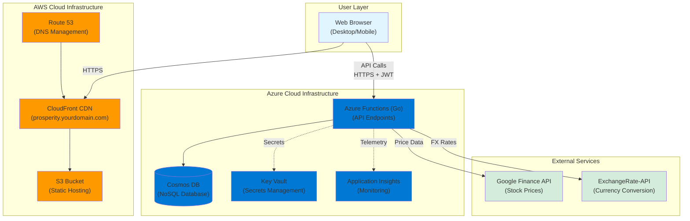
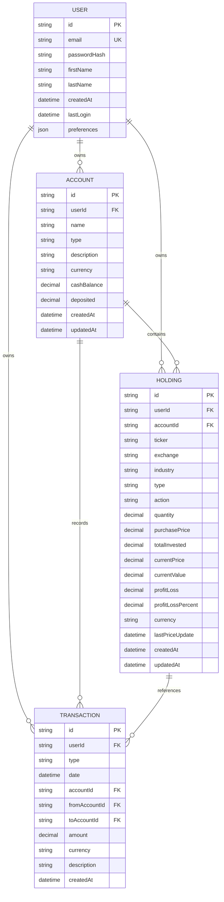
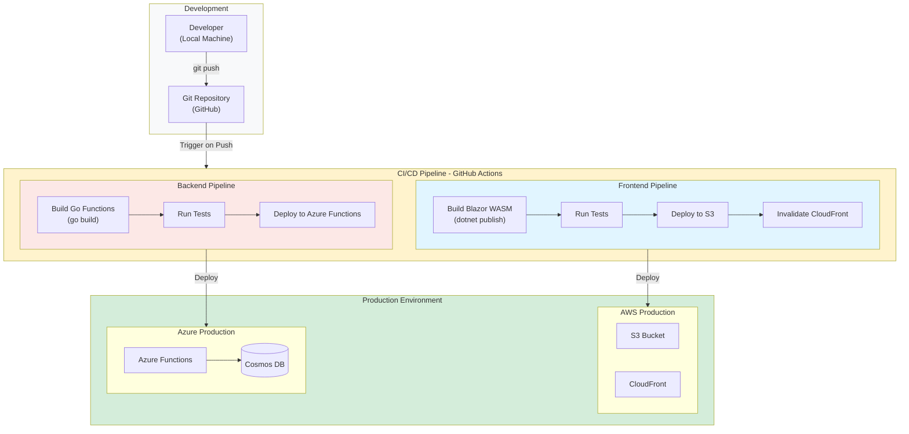
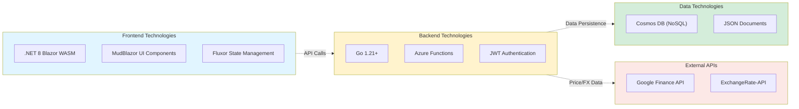

# Prosperity - System Architecture Diagrams

**Version:** 1.0  
**Date:** October 15, 2025  
**Purpose:** Visual representation of Prosperity's system architecture

---

## Table of Contents
1. [High-Level System Architecture](#high-level-system-architecture)
2. [Component Architecture](#component-architecture)
3. [Database Schema Relationships](#database-schema-relationships)
4. [Deployment Architecture](#deployment-architecture)

---

## High-Level System Architecture

This diagram shows the overall system architecture with the hybrid AWS/Azure cloud approach.

---

## Component Architecture

This diagram shows the detailed component structure of the frontend and backend layers.

```mermaid
flowchart TB
    subgraph Frontend["Frontend Layer - Blazor WebAssembly"]
        direction TB
        
        subgraph Pages["Pages"]
            Dashboard["Dashboard.razor<br/>(Portfolio Overview)"]
            Investments["Investments.razor<br/>(Holdings Management)"]
            Deposits["DepositsAndTransfers.razor<br/>(Cash Flow Tracking)"]
            Settings["Settings.razor<br/>(Configuration)"]
            Login["Login.razor<br/>(Authentication)"]
        end
        
        subgraph Components["Shared Components"]
            AccountCard["AccountSummaryCard.razor"]
            HoldingRow["HoldingRow.razor"]
            LoadingSpinner["LoadingSpinner.razor"]
        end
        
        subgraph Services["Frontend Services"]
            ApiService["ApiService.cs<br/>(HTTP Client)"]
            AuthService["AuthService.cs<br/>(Authentication)"]
            StateService["StateService.cs<br/>(Fluxor State)"]
        end
        
        Pages --> Components
        Pages --> Services
    end

    subgraph Backend["Backend Layer - Azure Functions (Go)"]
        direction TB
        
        subgraph Handlers["HTTP Handlers"]
            AccountHandler["accounts.go"]
            HoldingHandler["holdings.go"]
            TransactionHandler["transactions.go"]
            PriceHandler["prices.go"]
            AuthHandler["auth.go"]
        end
        
        subgraph Middleware["Middleware"]
            JWTMiddleware["auth.go<br/>(JWT Validation)"]
            CORSMiddleware["cors.go<br/>(CORS Config)"]
            LogMiddleware["logging.go"]
        end
        
        subgraph BusinessLogic["Service Layer"]
            PortfolioService["portfolio_service.go<br/>(Calculations)"]
            PriceService["price_service.go<br/>(API Integration)"]
            AuthServiceGo["auth_service.go<br/>(Token Management)"]
        end
        
        subgraph DataAccess["Data Access Layer"]
            AccountRepo["account_repository.go"]
            HoldingRepo["holding_repository.go"]
            TransactionRepo["transaction_repository.go"]
            UserRepo["user_repository.go"]
        end
        
        Handlers --> Middleware
        Handlers --> BusinessLogic
        BusinessLogic --> DataAccess
    end

    subgraph Database["Database Layer"]
        direction LR
        Users[("users<br/>collection")]
        Accounts[("accounts<br/>collection")]
        Holdings[("holdings<br/>collection")]
        Transactions[("transactions<br/>collection")]
    end

    Frontend -->|HTTPS/JSON| Backend
    Backend --> Database

    style Frontend fill:#e1f5ff
    style Backend fill:#fff3cd
    style Database fill:#d4edda
```

---

## Database Schema Relationships

This diagram shows the relationships between data entities in Cosmos DB.

---

## Deployment Architecture

This diagram shows the CI/CD pipeline and deployment flow.

---

## Technology Stack Overview

---

*Last Updated: October 15, 2025*
