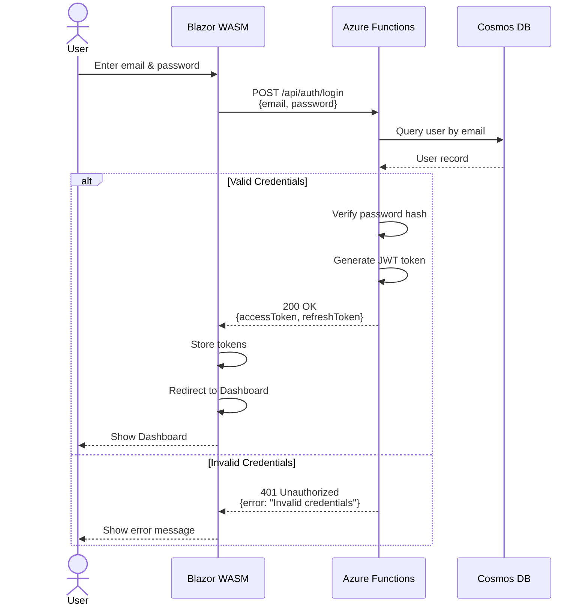
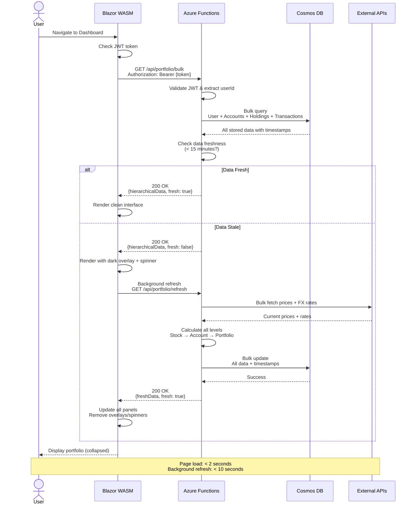
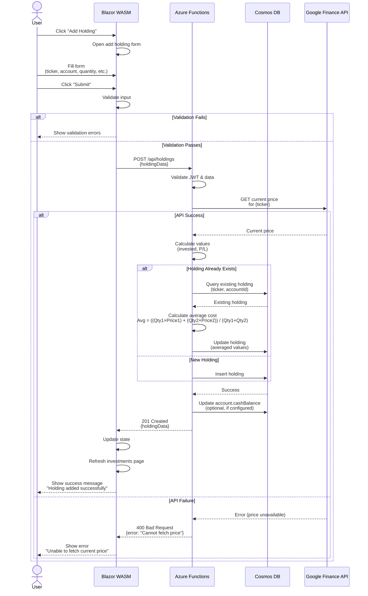
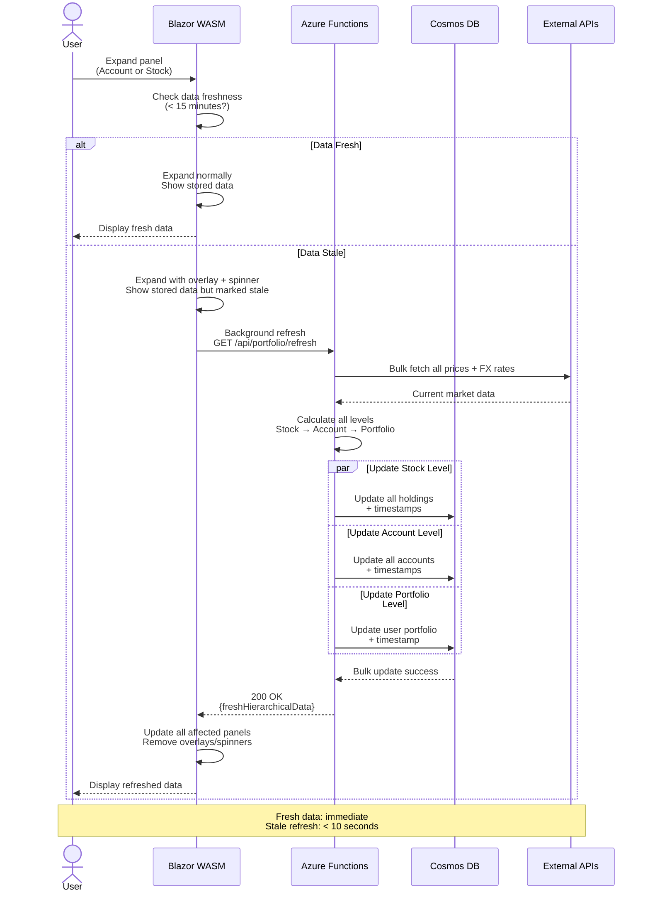
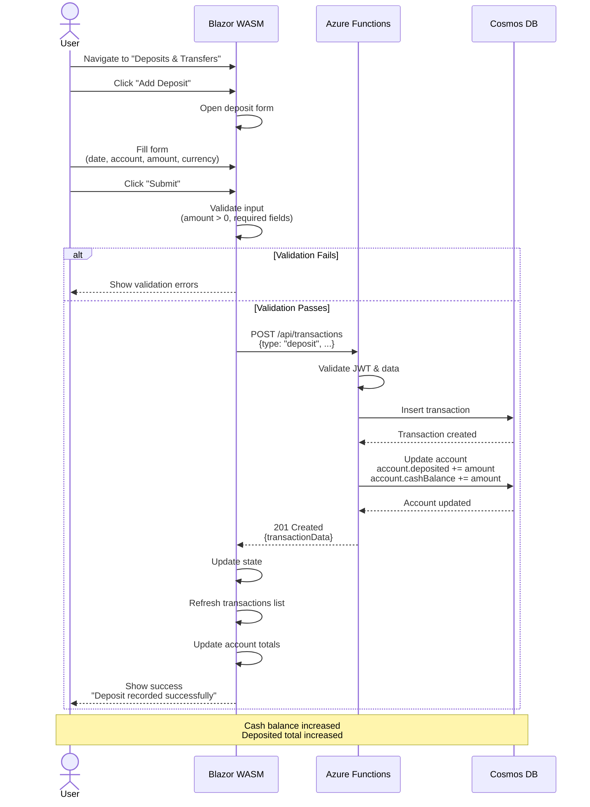
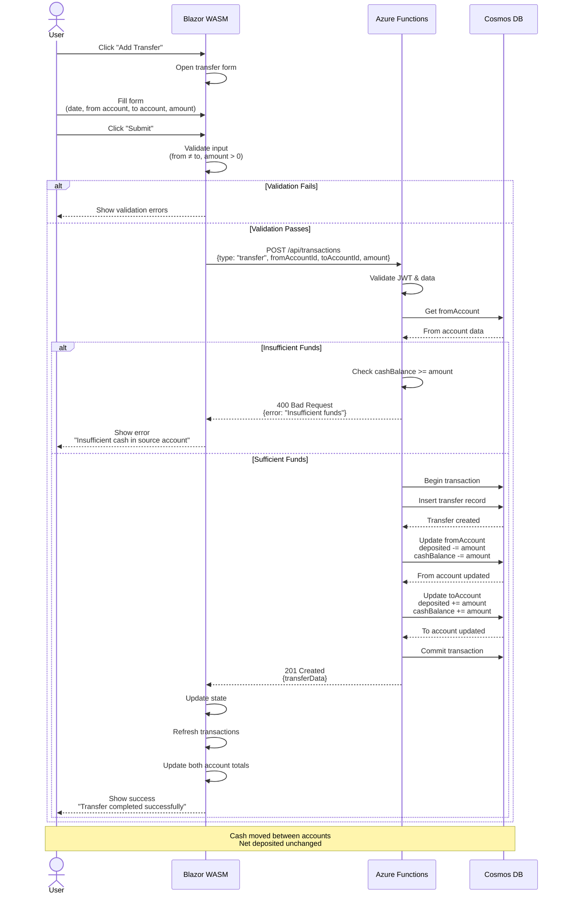
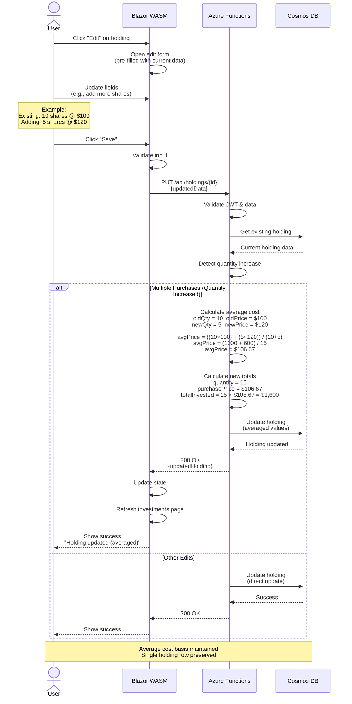
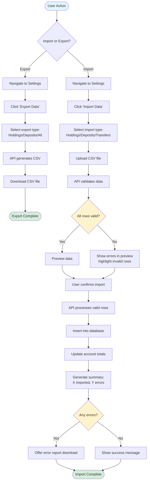
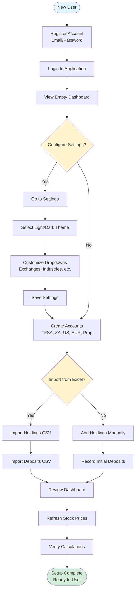
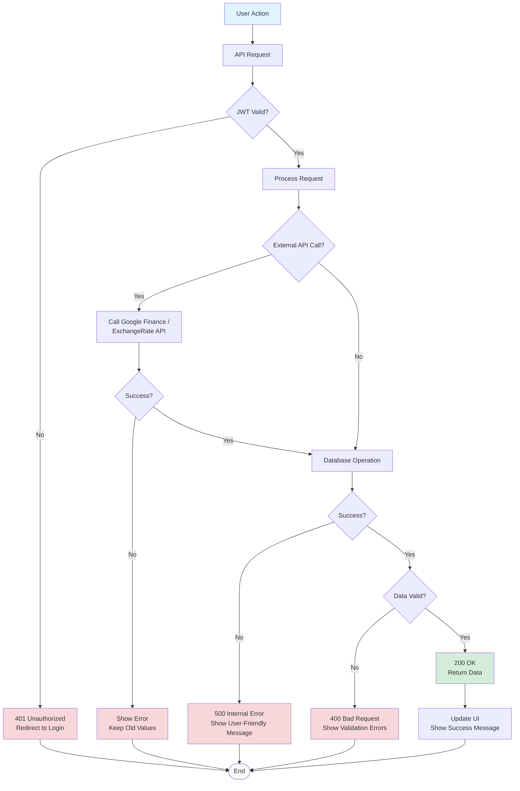

# Prosperity - Use Case Flow Diagrams

**Version:** 1.0  
**Date:** October 15, 2025  
**Purpose:** Visual representation of key user workflows and use cases

---

## Table of Contents
1. [User Authentication Flow](#user-authentication-flow)
2. [Dashboard Load Flow](#dashboard-load-flow)
3. [Add New Holding Flow](#add-new-holding-flow)
4. [Price Refresh Flow](#price-refresh-flow)
5. [Record Deposit Flow](#record-deposit-flow)
6. [Record Transfer Flow](#record-transfer-flow)
7. [Edit Holding (Multiple Purchases)](#edit-holding-multiple-purchases)
8. [Data Import/Export Flow](#data-importexport-flow)

---

## User Authentication Flow

---

## Dashboard Load Flow

---

## Add New Holding Flow

---

## Panel Expansion & Background Refresh Flow

---

## Record Deposit Flow

---

## Record Transfer Flow

---

## Edit Holding (Multiple Purchases)

---

## Data Import/Export Flow

---

## User Journey - First Time Setup

---

## Error Handling Flow

---

*Last Updated: October 15, 2025*
